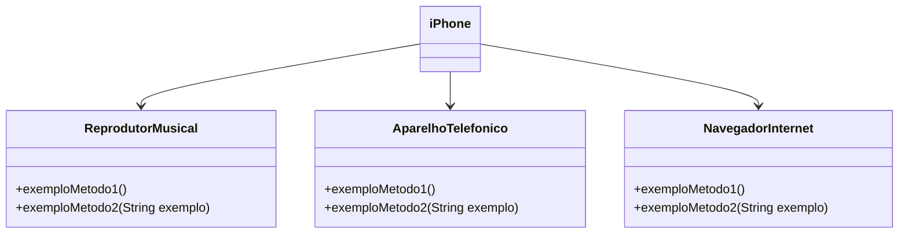

# Desafio iPhone - Java POO

Desenvolvir este projeto usando docker para implementa um desafio de POO baseado em interfaces e classes do iPhone, simulando os papéis de:

- Reprodutor Musical
- Aparelho Telefônico
- Navegador na Internet

## Estrutura do Projeto

desafio-iphone/
├── Dockerfile
├── README.md
└── src/
└── br/com/desafio/
├── Main.java
├── iPhone.java
└── interfaces/
├── ReprodutorMusical.java
├── AparelhoTelefonico.java
└── NavegadorInternet.java

### Exemplo de Diagrama UML

## Tecnologias

- Java 21 (OpenJDK)
- Programação Orientada a Objetos
- Docker

## Como rodar o projeto na maquina

docker build -t desafio-iphone .
docker run --rm desafio-iphone
